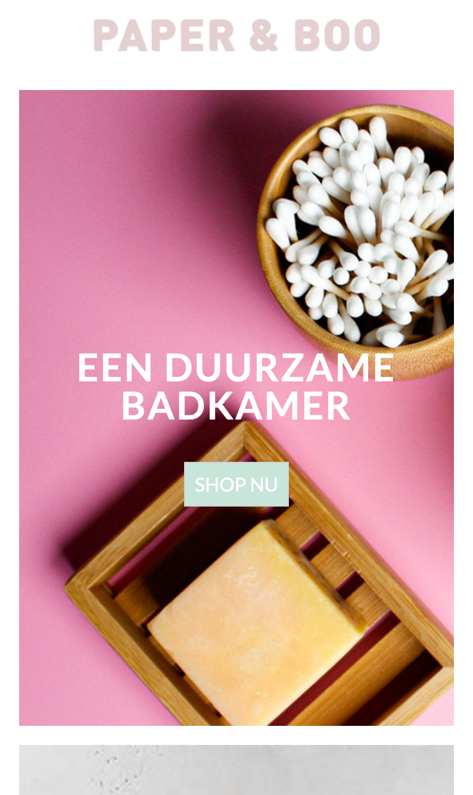

# Procesverslag
**Auteur:** Zoë Kostopoulos

## Bronnenlijst
1. -bron 1-
2. -bron 2-
3. -...-

## Intake (week 1)

**Je startniveau:** Blauwe piste. Ik werk niet vaak met html/css/js, en vind het vaak moeilijk te begrijpen zonder hulp. 

**Je focus:** Ik kies voor een het uitwerken van mijn surface laag. 

**Je opdracht:** Ik ga de website van Paper and Boo namaken, dit is een webshop voor eco/bio producten. Link naar de site: https://paperandboo.com/

**Screenshot(s) van de eerste pagina (small screen):**

**Screenshot(s) van de tweede pagina (small screen):**

## Breakdownschets (week 1)

## Voortgang 1 (week 3)

### Stand van zaken

Coderen ging best goed, opzetten ging gemakkelijk. Wel wat hulp gehad. Vooral moeite met centreren van teksten in de afbeeldingen gehad en in buttons. 

**Screenshot(s):**

Hier is een ruwe versie van de eerste pagina. Het lijkt al aardig op de huidige website. 

Hier zie je de andere afbeeldingen met buttons, ik heb nog geen producten in een grid gezet. 

### Agenda voor volgende meeting

-Dit wil ik de volgende keer afhebben-

- Grid bij maken 
- Beginnen aan product pagina 
- Gaan bedenken wat voor microinteractie 

### Verslag van meeting

Ik had dit gesprekje met Guus, hij vond het al een goed begin wat ik had gemaakt. Hij gaf me nog wat tips hoe en wat ik allemaal in een grid kon neerzetten, zodat ik dit niet op een andere manier ging doen. Ook had hij wat tips over hoe ik mijn code kon weergeven, maar zei ook dat ik eigenlijk gewoon moest aanhouden wat ik had en daar lekker mee verder moest gaan. 

## Voortgang 2

### Stand van zaken

Coderen ging moeizaam. Snapte niet heel erg veel van het grid. Dacht dat ik het onder de knie had, maar blijkbaar dus toch niet. De elementen die ik heb aangemaakt willen niet in het grid komen. Ben ook nog niet verder met de productpagina gegaan, zit veel tijd in het aanpassen van het grid. Microinteractie ook nog niet verder meegegaan. 

**Screenshot(s):**

Het is hier goed te zien dat het niet helemaal goed ging met het grid.  

Hier zie je ook dat de website nog niet helemaal wilt meewerken met de code die ik heb geschreven en wat ik wil laten zien.

### Agenda voor volgende meeting

-Dit wil ik de volgende keer afhebben-

- Hulp vragen en zoeken voor het grid 
- Beginnen aan product pagina 
- Gaan bedenken wat voor microinteractie 

## Voortgang 3

### Stand van zaken

Coderen ging na hulp veel beter. Grid zit nu goed in elkaar en heb een begin kunnen maken aan de productpagina. Mis nog wel elementen als een nav-bar en icoontjes. productpagina moet nog verder uitgewerkt worden en twijfel nog een beetje of ik een een footer er nog bij moet maken. Aangezien ik al vrij veel elementen heb verwerkt op de eerste pagina. 

**Screenshot(s):**

Grid zit mooi in elkaar, buttons zijn mooi uitgelijnt. Erg blij met hoe het eruit ziet. 

Stukje informatie was niet heel lastig om te verwerken. Af en toe werkte het niet helemaal mee. 

Begin van productpagina. Ziet er netjes uit. Er voor gekozen om de afbeeldingen niet te laten sliden. Heb voor andere microinteracties gekozen om later uit te werken.

Klein beetje informatie toegevoegd. Moet nog meer bij komen. 

### Agenda voor volgende meeting

-Dit wil ik de volgende keer afhebben-

- Verder met productpagina
- Navbar en iconen toevoegen
- Microinteracties gaan uitwerken
- Wel of niet footer toevoegen gaan bedenken

